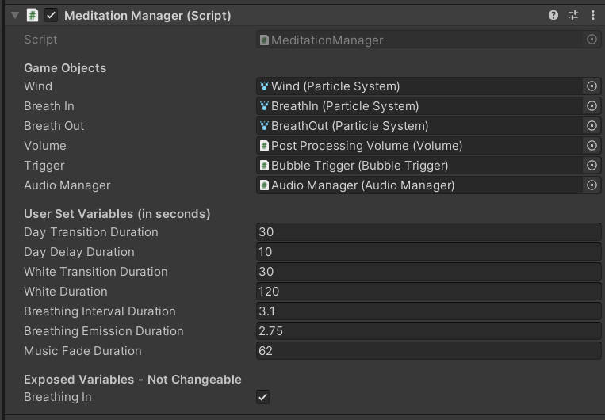

# Away-sis

A VR meditation application designed to assist the Christiana Care Oasis rooms in helping staff relax. Away-sis utilizes biofeedback and cognitive load information, to help users better understand how their meditation session went.

# Design

# How To Use

Project uses Unity 2020.3.36f1 and is intended for the HP Reverb Omnicept G2 Headset. The application can run on any Windows Mixed Reality headset, but biofeedback data will only work with the specific HP headset.

To fully utilize the biofeedback data, download HP Omnicept Tray and HP Omnicept Overlay. https://hpomnicept.zendesk.com/hc/en-us/articles/1500001463241-Use-Omnicept-Overlay-with-your-VR-Apps

Plug in your HP headset...

# Technical Details
The timing of the meditation and breathing can be set in the MeditationManager object.
