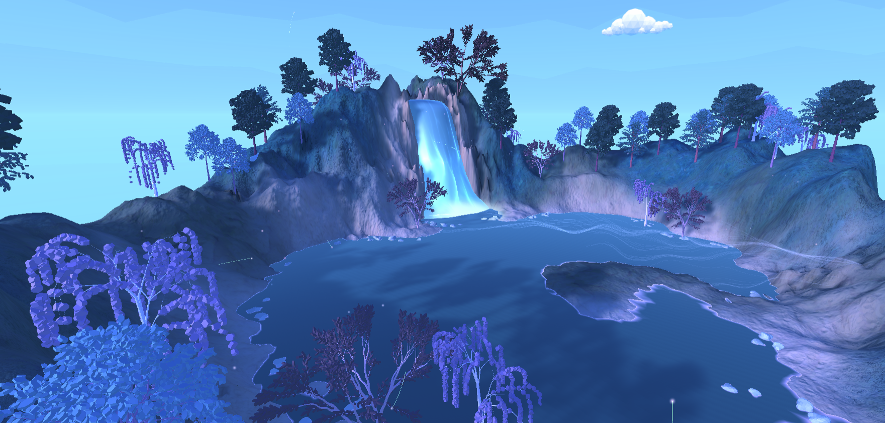

# Away-sis

A VR meditation application designed to assist the Christiana Care Oasis rooms in helping staff relax. Away-sis utilizes biofeedback and cognitive load information, to help users better understand how their meditation session went.

# Design
To reduce interuption and to boost immersive experience, the application does'nt use any human voice rather the sound of nature and reverbs of bells are used to create a relaxing experience. The colors and environment use a combination of colors associated with calming or cool(blue spectrum) along with elements(waterfall, trees, lake, wasps, fireflies, etc.) which are related to a peaceful natural oasis setting. 
The meditation experience cycles through a day to night to day with a period of Deep Focus in between with the goal of using an internal clock mechanism to wake up the user.
During the state of Deep Focus, the color from all objects fades away creating a sense of "nothingness" where the only colored item is the particle system for breathing in and out to make sure the user focusses on the breathing along with suitable background music to calm down.

# How To Use

Project uses Unity 2020.3.36f1 and is intended for the HP Reverb Omnicept G2 Headset. The application can run on any Windows Mixed Reality headset, but biofeedback data will only work with the specific HP headset.

To fully utilize the biofeedback data, download HP Omnicept Tray and HP Omnicept Overlay. https://hpomnicept.zendesk.com/hc/en-us/articles/1500001463241-Use-Omnicept-Overlay-with-your-VR-Apps

Plug in your HP headset...

# Technical Details
The timing of the meditation and breathing can be set in the MeditationManager object.

