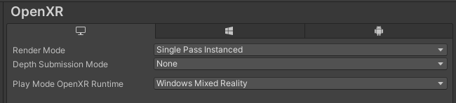

# Away-sis

A VR meditation application designed to assist the Christiana Care Oasis rooms in helping staff relax. Away-sis utilizes biofeedback and cognitive load information, to help users better understand how their meditation session went.

---

## Design

### Home Space

The space is created as a floating zen garden consisting of a temple, a personal tree, a spirit guide, aesthetic sand patterns, and a collection of floating bubbles on top of a lake.

To avoid overwhelming the user, this environment is designed as a simplistic starting point.

- The space serves as an area to bide time as the HP headset calibrates.
- The user can select the type of meditation by choosing from various floating bubbles on the right.
- It is also intended as an area to check feedback in the form of "Growth." To avoid assigning numbers to their quality of meditation, an abstract yet meaningful way to see their progress is created in the form of a tree which grows with the increase in the number of seconds spent under the "goldilocks zone". This feature is still a work in progress.

### Meditation Environment

To reduce interruption and to boost the immersive experience, the application doesn't use human voiceover, rather it uses the sound of nature and bell reverbs to create a relaxing experience. The environment uses a combination of calming blue colors and slowly moving elements (waterfall, trees, lake, wind, fireflies, etc.) to create a soothing, yet interesting oasis environment.

The meditation experience cycles through a day-to-night-to-day cycle with a period of Deep Focus in between. The idea is to appeal to the user's internal clock to ease waking.

During the state of Deep Focus, the color from the island fades away, creating a sense of "nothingness." The only colored item is the particle system for breathing in and out, which prompts the user to slow down and focus on their breathing. Hence, the project targets 3(vision, breathing, and sound) senses to enable a state of deep meditation, which helps lower the cognitive Load.

---

## How To Set-Up

The project uses Unity 2020.3.36f1 and is intended for the HP Reverb Omnicept G2 Headset. The application can run on any Windows Mixed Reality headset, but biofeedback data will only work with the specific HP headset.

### Enabling the Sensors

To fully utilize the biofeedback data, make sure the **Omnicept SDK** (Project uses v1.14) and **Omnicept Overlay** is downloaded.

- <https://developers.hp.com/omnicept/downloads>

Plug in your HP headset and open the **HP Omnicept Tray App**.

Once it's opened, you should see this icon in your windows bar. Click on it.

In the Client's tab, you will see all the applications that have access to the Headset's sensors.

Anytime a new application that uses the sensors is run, you will get a request to authorize it's access. Make sure you accept this request, or the sensors will not work.

### Running the Application

If the project is not already on your windows laptop

- Go to <https://github.com/Cchololens/Meditation-App>
- Click on clone and download or clone the project
- Unzip and open the folder /MeditationApp

The easiest way to run the application is by clicking on the included .exe files.

- **Away-sis_HomeStart** and **Away-sis_MeditationStart** starts the user in the home and meditation space respectively (If you want to skip the home space for demos).
- Again, make sure to approve the authorization request or the sensors will not work.
- If you have the headset plugged in, the application should automatically work.
- Collected .csv data will be output to the Away-sis_HomeStart_Data\StreamingAssets and Away-sis_MeditationStart_Data\StreamingAssets folders each time the application runs.

If you want to debug the app, you can also run the project through Unity

- If not already installed, install Unity and Unity Editor version 2020.3.36f.
- Open the Unity Hub, and in the Projects tab, open the root Meditation App folder.
- 
- In Project > Assets > Scenes , open the space you want to start in
- 
- Go to Edit > Project Settings
- 
- Click on the OpenVR tab and switch Play Mode to "Windows Mixed Reality"
- 
- Hit the play button at the top and everything should start playing in VR.

### Using HP Overlay

Open the HP Omnicept Overlay app

- You can follow this guide for a more detailed walkthrough of setup 
<https://hpomnicept.zendesk.com/hc/en-us/articles/1500001463241-Use-Omnicept-Overlay-with-your-VR-Apps>
- Approve it's authorization request from the HP Tray App
- The camera and sensors should turn on
- The headset needs to calibrate to each person. You should see the cognitive load graph start moving after someone puts the headset on for a minute.

---

## TroubleShooting

If the headset shows a black screen, but appears to be on:

- Most likely the headset was moved and the floor level needs to be set up again
- Restart windows with the headset plugged in
- Follow the prompt in headset to calibrate the floor level
- Start the application again

If the headset runs the application, but is not getting sensor data:

- The Client request for sensor use may not have been approved
- Open the HP Omnicept Tray Application
- Restart Away-sis
- Approve any pop-ups on screen or requests in the Tray Application

If you see the application runs on your desktop instead of in Windows Mixed Reality Portal or your headset.

- The headset may not have connect properly
- Check all the cable connections
- Try restarting Windows Mixed Reality Portal
- Try restarting Windows

---

## Technical Details

The timing of the meditation and breathing can be set in the MeditationManager object.

